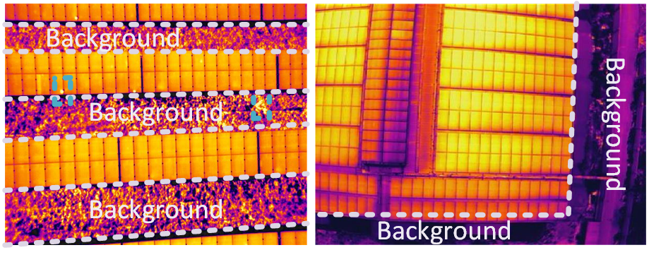
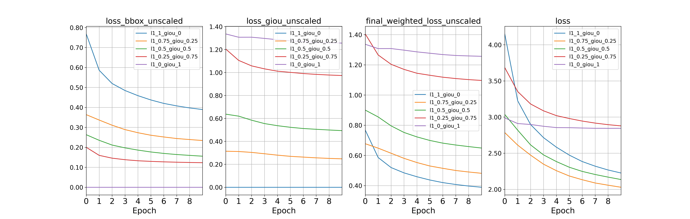
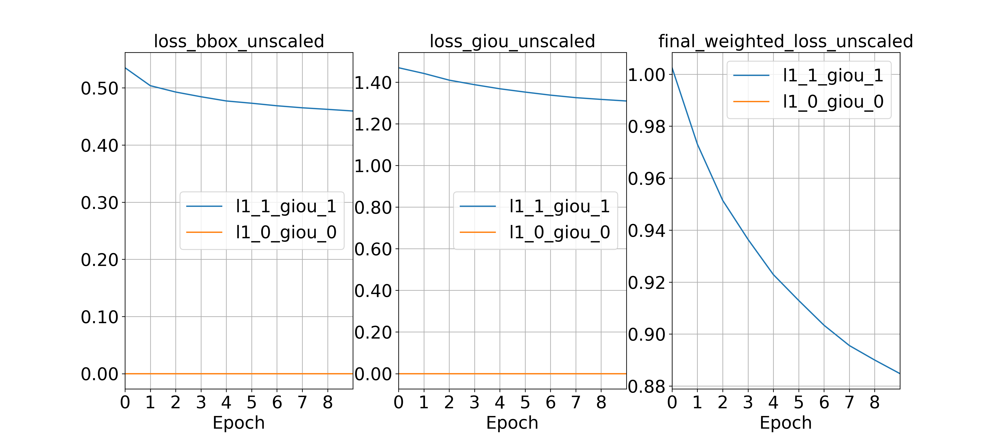

# You Only Look at One Sequence (YOLOS-PV) for Solar Panel Project


 

SOlar panel cells defect Classification uses computer vision models to classify defects in dataset that has already gone through imaging techniques like electroluminiscence or thermal imaging. Each models are applied on the benchmark dataset like elpv-4 with four classes, elpv-2 (Coined from elpv-4 but having 2 classes of functional and defective) and elpv-12 with 12 classes.

### 🗒 Datasets
You can download the benchmark thermal Images dataset below that is prepared
 in COCO data format: [COCO](http://cocodataset.org/)
[Solar Thermal Images](https://drive.google.com/drive/folders/1VJOP50Ll01DgL3Gl4sVYWL7HVlzmoNy-?usp=share_link)


<details>
  <summary>Sample Dataset </summary>
<p>
  
    Solar Thermal Images sample dataset with background segmentation.
</p>
 
</details>

### 🗒 Models Implementation with accuracy results


Models architecture is based on the YOLOS model implementation with the introduction of weighted combination of loss function.
The Loss function are calculated using:

$$\begin{align}
 \text{Final Weighted Loss} = \frac{(W_{\text{giou}} \times {\text{GIoU loss}}) + (W_{\text{L1}} \times {\text{L1 loss}}) }{W_{\text{giou}} + W_{\text{L1}}}
 \end{align}$$

Google Colab Premium of 14GB GPU was used for the training.


### 🗒 Running the code Google Colab

<!--##########################################################################################-->

### Requirement

```python
!pip install cython scipy
!pip install -U 'git+https://github.com/cocodataset/cocoapi.git#subdirectory=PythonAPI'
```

### Data preparation
We expect the directory structure of dataset to be the following:
```
path/to/solarthermalimages/
  annotations/  # annotation json files
  train2017/    # train images
  val2017/      # val images
``` 
### To mount Google drive for dataset import. 
### Downloa the dataset from [Solar Thermal Images](https://drive.google.com/drive/folders/1VJOP50Ll01DgL3Gl4sVYWL7HVlzmoNy-?usp=share_link)

```python
from google.colab import drive
drive.mount('/content/drive')
```

### Training the YOLOS-PV Model


```python
%cd /content/YOLOS-PV
```

```python
!python main.py  \
  --coco_path /content/YOLOS-PV/data \
  --batch_size 1  \
  --lr 2.5e-4 \
  --start_epoch 50 \
  --epochs 100 \
  --backbone_name small  \
  --eval_size 512 \
  --init_pe_size 512 864 \
  --mid_pe_size 512 864  \
  --weighted_giou 0.75 \
  --weighted_l1 0.25 \
  --output_dir HOME/output_dir \
  ```


### Visualization

```python

!python attention_map.py  \
  --coco_path /content/YOLOS-PV/data  \
  --index 2  \
  #--checkpoint /content/YOLOS-PV/HOME/output_dir/checkpoint0099.pth \
  --threshold 0.3 \
  --project /content/drive/MyDrive/dataset/YOLOS-PV_dataset/results/exp13 \
  --name exp

```


### Evaluation

To evaluate `YOLOS-S` model on COCO, run:
```python
!python -m torch.distributed.launch 
    --nproc_per_node=1 --use_env main.py 
    --coco_path /path/to/solarthermalimages
    --batch_size 1 
    --backbone_name small 
    --eval --eval_size 800 
    --init_pe_size 512 864 
    --mid_pe_size 512 864 
    --resume /path/to/YOLOS-PV
```


<!--##########################################################################################-->

### Paper Results
The plots for the adjusted weighted values of $$ W_{\text{giou}} = 0.75 $$ and $$ W_{\text{L1}} = 0.25 $$
and $$ W_{\text{giou}} = 0,1 $$ and $$ W_{\text{L1}} = 0,1 $$

 🔥 Loss Function plots 🔥

 

 


<!--##########################################################################################-->


### Acknowledgement
[YOLOS](https://github.com/hustvl/YOLOS)
[DETR](https://github.com/facebookresearch/detr)


